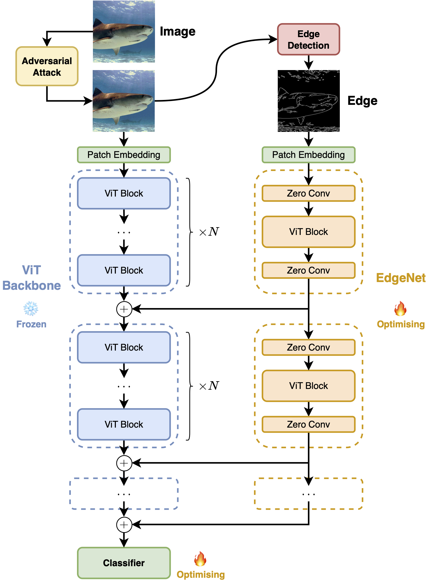
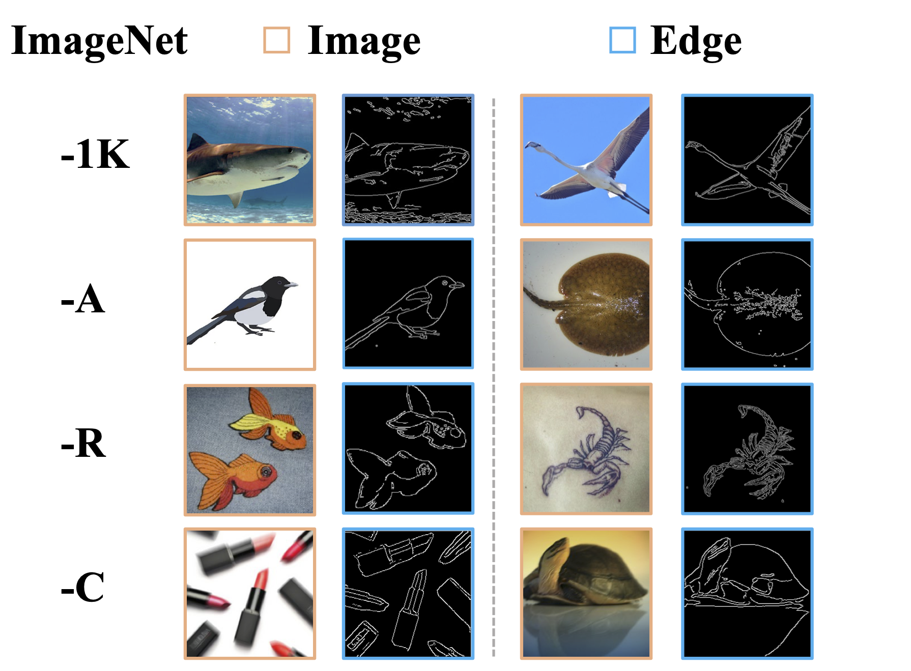

# Harnessing Edge Information for Improved Robustness in Vision Transformers

Yanxi Li (University of Sydney), Chengbin Du (University of Sydney), Chang Xu (University of Sydney)

In Proceedings of the AAAI Conference on Artificial Intelligence, 2024

\[[Paper](https://ojs.aaai.org/index.php/AAAI/article/view/28110)\] \[[Poster](assets/edgenet-aaai-poster.pdf)\]



## Abstract

Deep Neural Networks (DNNs) have demonstrated remarkable accuracy in vision classification tasks. However, they exhibit vulnerability to additional noises known as adversarial attacks. Previous studies hypothesize that this vulnerability might stem from the fact that high-accuracy DNNs heavily rely on irrelevant and non-robust features, such as textures and the background. In this work, we reveal that edge information extracted from images can provide relevant and robust features related to shapes and the foreground. These features assist pretrained DNNs in achieving improved adversarial robustness without compromising their accuracy on clean images. A lightweight and plug-and-play EdgeNet is proposed, which can be seamlessly integrated into existing pretrained DNNs, including Vision Transformers, a recent family of state-of-the-art models for vision classification. Our EdgeNet can process edges derived from either clean nature images or noisy adversarial images, yielding robust features which can be injected into the intermediate layers of the frozen backbone DNNs. The cost of obtaining such edges using conventional edge detection algorithms (e.g., Canny edge detector) is marginal, and the cost of training the EdgeNet is equivalent to that of fine-tuning the backbone network with techniques such as Adapter.

## Requirements

```bash
pip install torch==1.13.1+cu117 torchvision==0.14.1+cu117 torchaudio==0.13.1 --extra-index-url https://download.pytorch.org/whl/cu117
pip install timm==0.6.13
pip install opencv-python==4.8.0.74
```

## Usage

```python
import torch

from PIL import Image
from timm.models import create_model
from torchvision import transforms

from config import Config
from canny_edge import CannyEdge
from model import robust_vit_base_patch16_224


# get config
config = Config('rob_vit_b16.yaml')
args = config.load_config()

# get edge detector
edge_fn = CannyEdge(
    auto=args.canny_threshold_auto,
    lower=args.canny_threshold_lower,
    upper=args.canny_threshold_upper,
)

# get model
model_kwargs = dict(
    num_classes=args.num_classes,
    drop_rate=args.drop,
    drop_path_rate=args.drop_path,
    global_pool=args.gp,
    bn_momentum=args.bn_momentum,
    bn_eps=args.bn_eps,
    start_index=args.start_index,
    interval=args.interval,
    zero_conv_channel=args.zero_conv_channel
)
model = create_model(
    model_name=args.model,
    pretrained=args.pretrained,
    checkpoint_path=args.initial_checkpoint,
    scriptable=args.torchscript,
    **model_kwargs,
)

eval_transforms = transforms.Compose([
    transforms.Resize(
        size=248,
        interpolation=transforms.functional.InterpolationMode.BICUBIC, 
        max_size=None,
        antialias=None
    ),
    transforms.CenterCrop(size=(224, 224)),
    transforms.ToTensor(),
])

model.eval_transforms_norm = transforms.Compose([
    transforms.Normalize(
        mean=torch.tensor([0.5000, 0.5000, 0.5000]),
        std=torch.tensor([0.5000, 0.5000, 0.5000]),
    )
])

model.eval_transforms_norm_c = transforms.Compose([
    transforms.Normalize(
        mean=torch.tensor([0.5000]),
        std=torch.tensor([0.5000]),
    )
])

if torch.cuda.is_available():
    print('cuda')
    model.to('cuda')
model.eval()

# get data
image_PIL = Image.open('ILSVRC2012_val_00000077.JPEG')
image_PIL = image_PIL.convert("RGB")
image_tensor = eval_transforms(image_PIL)

# forward
image_with_edge = edge_fn(image_tensor)
image_with_edge = image_with_edge.unsqueeze(0)
x, edge = image_with_edge[:, :3], image_with_edge[:, 3:]

print(x.size(), edge.size())
# expect: 'torch.Size([1, 3, 224, 224]) torch.Size([1, 1, 224, 224])'

output = model(x, edge)
print(output.size())
# expect: 'torch.Size([1, 1000])'
```



## Citation
```
@inproceedings{li2024harnessing,
  title={Harnessing Edge Information for Improved Robustness in Vision Transformers},
  author={Li, Yanxi and Du, Chengbin and Xu, Chang},
  booktitle={Proceedings of the AAAI Conference on Artificial Intelligence},
  volume={38},
  number={4},
  pages={3252--3260},
  year={2024}
}
```